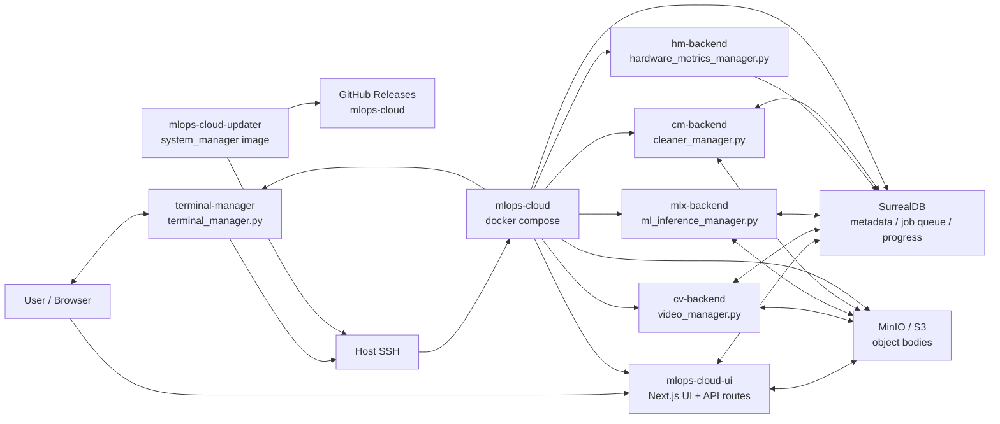
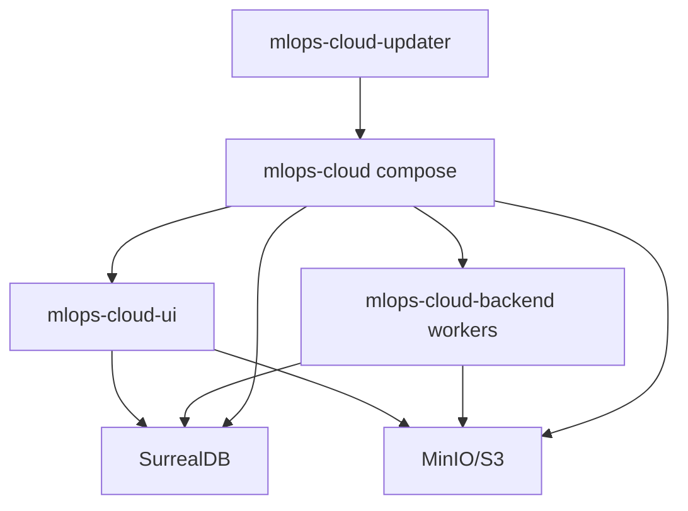
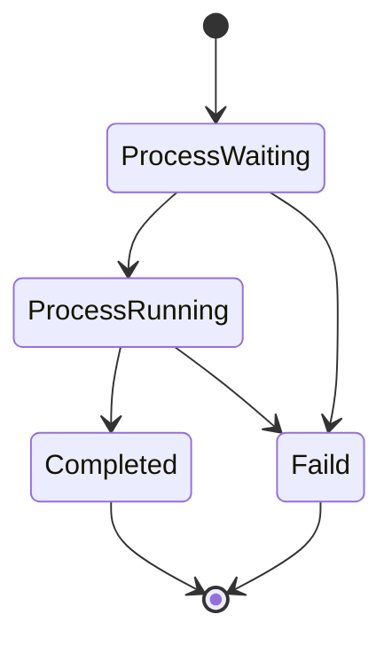
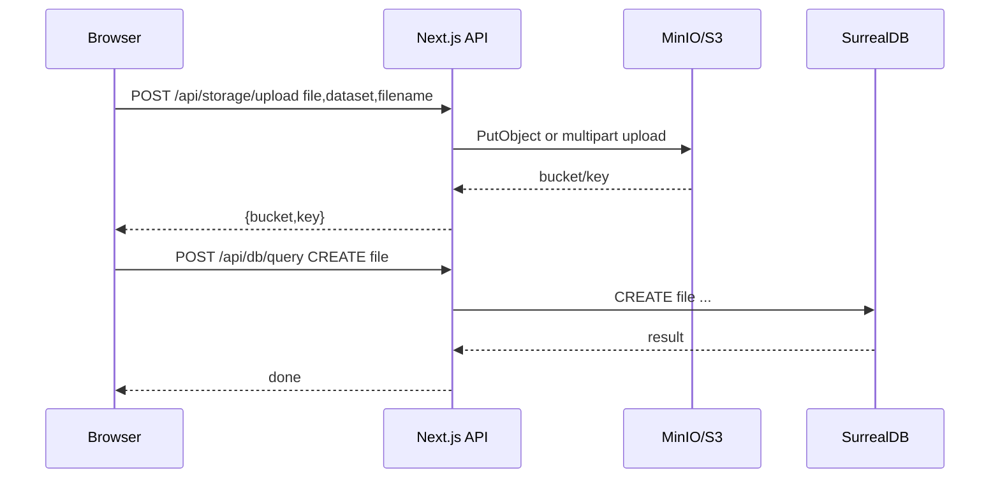
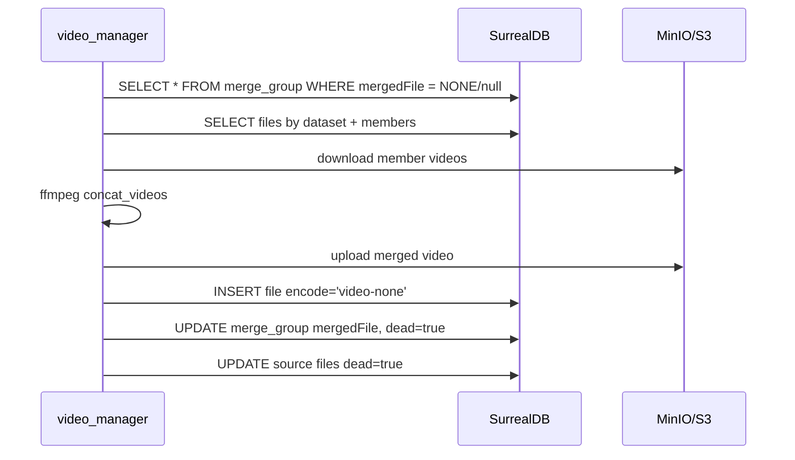
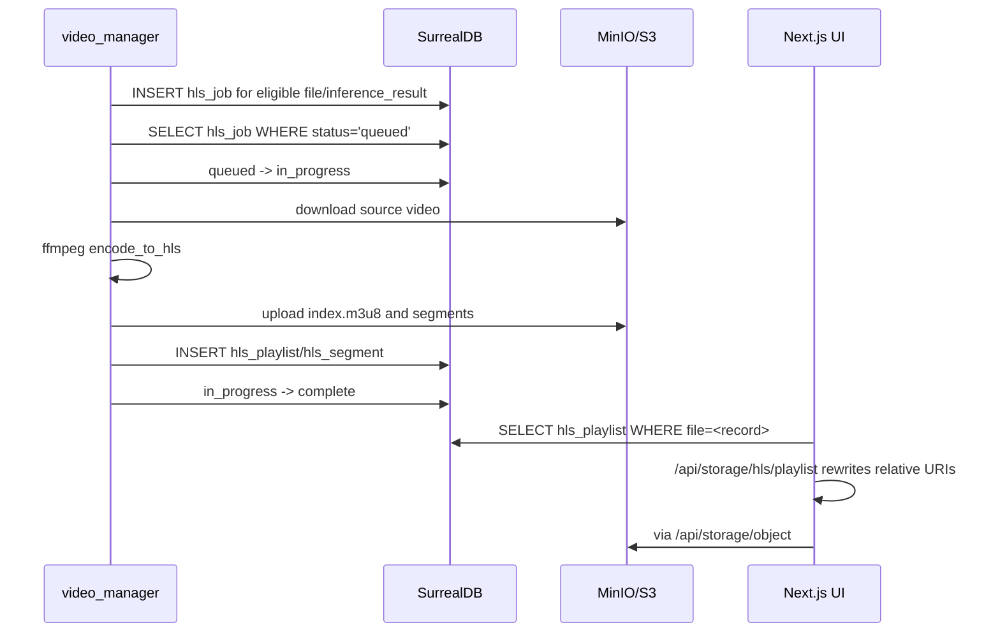
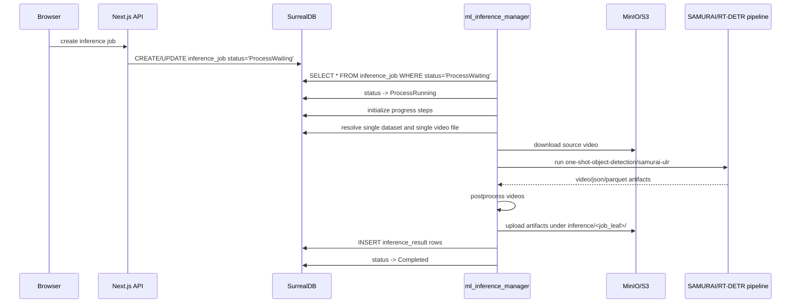
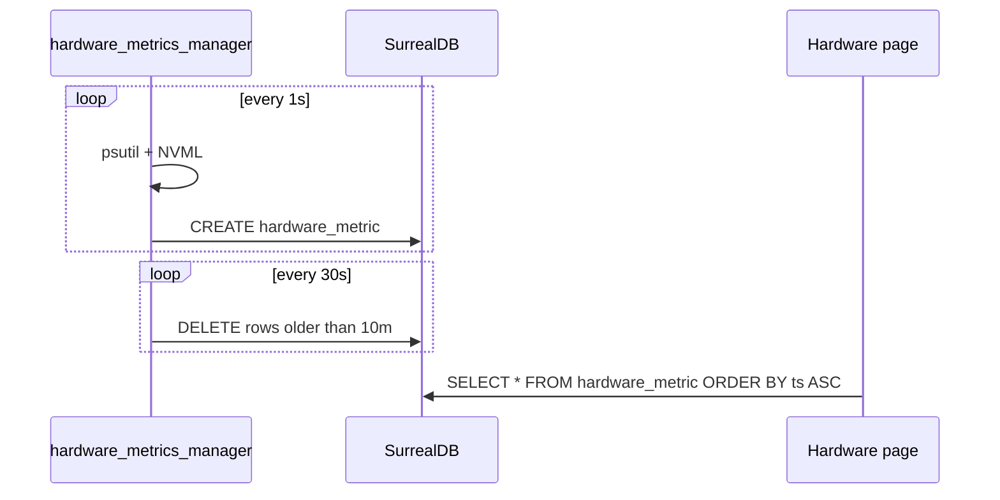

# MLOps Cloud アーキテクチャ詳細

作成日: 2026-04-28  
対象ワークスペース: `/Users/taiga/Desktop/mlops_cloud_ws`

このドキュメントは、同一ワークスペースにある4つのリポジトリを読み取り、相互依存、実行時構成、主要なデータフロー、DB/S3スキーマ、ジョブ処理の仕組みを整理したものです。

## 1. 全体像

このシステムは、MLOps向けのWeb UI、オブジェクトストレージ、メタデータDB、GPU/CPUバックエンドワーカー、デプロイ更新ワーカーで構成されます。

主要な設計は次の通りです。

- `mlops-cloud-ui` がユーザー操作を受け付けるNext.jsアプリ。
- `mlops-cloud` が本番寄りの統合 `docker-compose.yml` を持つオーケストレーション用リポジトリ。
- `mlops-cloud-backend` が動画処理、推論、ハードウェアメトリクス、クリーンアップ、ターミナルブリッジを提供するPythonワーカー群。
- `mlops-cloud-updater` が最新リリースを監視して `mlops-cloud` 側のcompose環境を更新する補助サービス。
- SurrealDB がジョブ、ファイル、アノテーション、結果、進捗、メトリクスなどの共有状態を保持する。
- MinIO/S3 がアップロードファイル、動画HLS、推論結果、サムネイルなどの実体を保持する。



## 2. リポジトリごとの責務

| リポジトリ | 主な責務 | 主要技術 | 実行時の位置づけ |
|---|---|---|---|
| `mlops-cloud` | 統合デプロイ定義。UI、DB、MinIO、各バックエンドをまとめて起動する。 | Docker Compose | 本番/統合環境の入口 |
| `mlops-cloud-ui` | Web UI、Next.js APIによるDB/S3プロキシ、アップロード、データセット管理、アノテーション、推論/学習ジョブ操作、結果閲覧、ターミナルUI。 | Next.js 16, React 19, Chakra UI, React Query, AWS SDK v3, SurrealDB client, DuckDB WASM, hls.js | ユーザー操作の入口 |
| `mlops-cloud-backend` | DBをポーリングして動画変換、HLS生成、推論、結果アップロード、メトリクス収集、削除処理、WebSocketターミナルを実行。 | Python 3.11, uv, SurrealDB client, boto3, FFmpeg, Torch/CUDA, SAMURAI/SAM2/RT-DETR, psutil, pynvml, paramiko, websockets | 非同期ワーカー群 |
| `mlops-cloud-updater` | 最新GitHub Releaseを監視し、ホスト上の `~/mlops-cloud` を指定リリースへ切り替えて `docker compose up -d --pull always` を実行。 | Docker Compose, `system_manager.py` イメージ | 自動更新補助 |

## 3. デプロイ構成

統合構成は `mlops-cloud/docker-compose.yml` に集約されています。

### 3.1 サービス一覧

| サービス | イメージ | 公開ポート | 役割 |
|---|---|---:|---|
| `object-storage` | `minio/minio:RELEASE.2025-07-23T15-54-02Z` | `9000`, `9001` | S3互換ストレージ。APIとコンソールを提供。 |
| `database` | `surrealdb/surrealdb:v2.3` | `8000` | SurrealDB。`file:/data/db` 永続化。 |
| `cloud-ui` | `ghcr.io/takanotaiga/mlops-cloud-ui:main` | `3000` | Next.js UI/API。 |
| `mlx-backend` | `taigatakano/mlops-cloud-backend-gpu:main` | なし | 推論ジョブ実行。`ml_inference_manager.py`。 |
| `cv-backend` | `taigatakano/mlops-cloud-backend-gpu:main` | なし | 動画/HLS/サムネイル/マージ処理。`video_manager.py`。 |
| `hm-backend` | `taigatakano/mlops-cloud-backend-base:main` | なし | CPU/GPUメトリクス収集。`hardware_metrics_manager.py`。 |
| `cm-backend` | `taigatakano/mlops-cloud-backend-base:main` | なし | 論理削除・孤児データ削除。`cleaner_manager.py`。 |
| `terminal-manager` | `taigatakano/mlops-cloud-backend-base:main` | `8765` | WebSocketからホストSSHへ接続するターミナルブリッジ。 |

`object-storage` と `database` は永続ボリュームを持ちます。

- `minio-data`
- `surrealdb-data`

### 3.2 共有環境変数

多くのサービスは同じDB/S3設定を共有します。

SurrealDB:

```env
SURREAL_URL=ws://database:8000/rpc
SURREAL_NS=mlops
SURREAL_DB=cloud_ui
SURREAL_USER=root
SURREAL_PASS=root
```

MinIO/S3:

```env
MINIO_ENDPOINT_INTERNAL=http://object-storage:9000
MINIO_REGION=us-east-1
MINIO_ACCESS_KEY_ID=minioadmin
MINIO_SECRET_ACCESS_KEY=minioadmin
MINIO_BUCKET=mlops-datasets
MINIO_FORCE_PATH_STYLE=true
S3_MULTIPART_THRESHOLD_BYTES=1000000000
```

UIにも `NEXT_PUBLIC_SURREAL_*` が設定されていますが、現在のUI実装ではブラウザからSurrealDBへ直接接続せず、Next.js API route `POST /api/db/query` がサーバー側でDBへ接続します。`NEXT_PUBLIC_*` は後方互換またはビルド時デフォルトの意味合いが強いです。

## 4. 依存関係

### 4.1 実行時依存



実行時の依存は、DBとS3を共有する形で疎結合になっています。UIとバックエンドは直接HTTP APIで会話していません。UIがDBにジョブやファイルメタデータを書き、バックエンドがDBをポーリングして処理し、結果をS3/DBへ戻します。

### 4.2 イメージ/リリース依存

- `mlops-cloud` は `ghcr.io/takanotaiga/mlops-cloud-ui:main` に依存します。
- `mlops-cloud` は `taigatakano/mlops-cloud-backend-base:main` と `taigatakano/mlops-cloud-backend-gpu:main` に依存します。
- `mlops-cloud-updater` は `ghcr.io/takanotaiga/mlops-cloud-backend-sm:sha-f67b257` を使います。
- `mlops-cloud-updater` の実装は `system_manager.py` 相当で、GitHub APIから `takanotaiga/mlops-cloud` の latest release を取得してホスト側 `~/mlops-cloud` を更新します。

### 4.3 CI/CD

`mlops-cloud-ui`:

- `.github/workflows/docker-publish.yml`
- `main` push、`v*.*.*` tag、PR、手動実行に対応。
- GHCRへDocker imageをpush。

`mlops-cloud-backend`:

- `.github/workflows/docker-build-containers.yaml`
- `Dockerfile.base` と `Dockerfile.gpu` の2種類をDocker Hubへpush。
- matrixで `-base` と `-gpu` をビルド。

## 5. UIの構造

### 5.1 主要ページ

| パス | 実装 | 役割 |
|---|---|---|
| `/dataset` | `components/dataset/dataset-list-page.tsx` | `file` テーブルからデータセット一覧を表示。 |
| `/dataset/upload` | `app/dataset/upload/page.tsx` | ファイルをS3へアップロードし、`file` レコードを作成。動画の場合はエンコードモードも記録。 |
| `/dataset/opened-dataset` | `app/dataset/opened-dataset/client.tsx` | データセット内のファイル一覧、HLS状態、ソフト削除、マージ状態を表示。 |
| `/dataset/opened-dataset/object-card` | `app/dataset/opened-dataset/object-card/client.tsx` | 個別ファイル詳細、ラベル、アノテーション、テキストラベル、削除。 |
| `/dataset/opened-dataset/object-card/player` | `player-client.tsx` | HLSプレイリストを取得し、動画を再生。 |
| `/training` | `components/training/training-jobs-page.tsx` | `training_job` 一覧。 |
| `/training/create` | `app/training/create/page.tsx` | `training_job` を作成/更新。 |
| `/training/opened-job` | `app/training/opened-job/client.tsx` | 学習ジョブ詳細、停止、削除。 |
| `/inference` | `components/inference/inference-jobs-page.tsx` | `inference_job` 一覧。 |
| `/inference/create` | `app/inference/create/page.tsx` | `inference_job` を作成/更新。 |
| `/inference/opened-job` | `app/inference/opened-job/client.tsx` | 推論ジョブ詳細、進捗、結果動画/JSON/Parquet閲覧。 |
| `/hardware_metric` | `components/hardware/HardwareMetricPage.tsx` | `hardware_metric` を1秒ポーリングしてCPU/GPUグラフ表示。 |
| `/terminal` | `components/terminal/terminal-page.tsx` | WebSocket経由でSSHターミナルを操作。 |
| `/docs/user`, `/docs/developer` | `app/docs/*` | 利用者/開発者向け説明。 |

### 5.2 Next.js API routes

| Route | 役割 |
|---|---|
| `POST /api/db/query` | ブラウザから受けたSQLとvarsをサーバー側SurrealDB clientで実行。 |
| `GET /api/status` | SurrealDB疎通とS3バケット疎通を確認。S3バケットがなければ作成を試みる。 |
| `POST /api/storage/upload` | `multipart/form-data` を受け、S3へPutObjectまたはmultipart upload。 |
| `GET/HEAD/DELETE /api/storage/object` | S3オブジェクトのプロキシ配信、メタデータ取得、削除。Rangeにも対応。 |
| `GET /api/storage/hls/playlist` | S3上の `.m3u8` を取得し、相対セグメントURIを `/api/storage/object` に書き換える。 |

重要な点として、ブラウザはMinIOやSurrealDBに直接アクセスしません。`components/surreal/SurrealProvider.tsx` は `fetch("/api/db/query")` を使うAPI-backed clientになっています。S3についても `components/utils/minio.ts` は署名URLではなく `/api/storage/object` のプロキシURLを返します。

## 6. バックエンドの構造

`mlops-cloud-backend` は単一APIサーバーではなく、複数の常駐ワーカーを同じコードベースから起動する構成です。

### 6.1 共通モジュール

| ファイル | 役割 |
|---|---|
| `backend_module/config.py` | `SURREAL_*` と `MINIO_*` を読み込み、旧 `S3_*` / `SURREAL_ENDPOINT` 系にも対応。 |
| `backend_module/database.py` | SurrealDB clientをラップ。スレッドロック付き `query()`。 |
| `backend_module/object_storage.py` | boto3 S3 clientラッパー。バケット作成、upload/download/delete、multipart対応。 |
| `backend_module/encoder.py` | FFmpeg操作。HLS化、HLS->MP4、サムネイル、concat、transcode、timelapse等。 |
| `backend_module/progress_tracker.py` | `inference_job.progress` のステップ状態管理。 |
| `query/*.py` | SurrealDBクエリを用途別に分離。 |

### 6.2 ワーカー

| ワーカー | 起動コマンド | 役割 |
|---|---|---|
| `video_manager.py` | `uv run /workspace/src/video_manager.py` | 動画マージ、サムネイル生成、HLS生成、HLS再パック。 |
| `ml_inference_manager.py` | `uv run /workspace/src/ml_inference_manager.py` | `inference_job` を処理し、ML推論を実行して結果をS3/DBへ登録。 |
| `hardware_metrics_manager.py` | `uv run /app/hardware_metrics_manager.py` | psutil/NVMLからメトリクスを収集し、`hardware_metric` へ保存。 |
| `cleaner_manager.py` | `uv run /app/cleaner_manager.py` | `dead=true` や孤児レコードを削除し、関連S3オブジェクトも消す。 |
| `terminal_manager.py` | `uv run /app/terminal_manager.py` | WebSocketを受け、初回 `auth` のSSH資格情報でホストへSSHしPTYを中継。 |
| `system_manager.py` | updater系イメージで使用 | GitHub latest releaseを監視し、ホスト上でgit switchとdocker compose upを実行。 |

## 7. データモデル

SurrealDBは明示的なスキーマファイルではなく、各UI/ワーカーが必要なフィールドを作成/更新する形です。実装から読み取れる主要テーブルは以下です。

### 7.1 `file`

アップロードされた元ファイル、マージ後動画、HLS再パック後動画のメタデータを保持します。

主なフィールド:

| フィールド | 意味 |
|---|---|
| `id` | SurrealDB record id。 |
| `name` | 表示名/元ファイル名。 |
| `key` | S3キー。例: `<dataset>/<filename>`。 |
| `bucket` | S3 bucket。通常 `mlops-datasets`。 |
| `size` | byteサイズ。 |
| `mime` | MIME type。 |
| `dataset` | データセット名。UIではデータセット単位のグルーピングキー。 |
| `encode` | 動画処理モード。例: `video-none`, `video-merge`, `video-hls-repacked`。 |
| `uploadedAt` | 作成時刻。 |
| `thumbKey` | 動画サムネイルS3キー。例: `<dataset>/.thumbs/<filename>.jpg`。 |
| `dead` | ソフト削除フラグ。Cleanerが物理削除。 |
| `meta` | マージやHLS再パックなどの補足情報。 |

### 7.2 `merge_group`

複数動画を1つに結合するための指示を保持します。

| フィールド | 意味 |
|---|---|
| `dataset` | 対象データセット。 |
| `mode` | 現状UIは `all` を作成。 |
| `members` | 結合対象ファイル名の配列。自然順ソートされた動画名。 |
| `mergedFile` | 結合後 `file` record id。 |
| `createdAt`, `mergedAt` | 作成/処理完了時刻。 |
| `dead` | 処理後Cleanerで削除するためのフラグ。 |

### 7.3 `hls_job`

HLS生成キューです。

| フィールド | 意味 |
|---|---|
| `file` | `file` または `inference_result` へのrecord参照。 |
| `status` | `queued` → `in_progress` → `complete`、または `faild`。 |
| `created_at` | キュー投入時刻。 |

`video_manager.py` が以下を自動投入します。

- `file` のうち `encode = 'video-none'` かつ `mime ~ 'video/'` で未HLSのもの。
- `inference_result` のうち `meta.artifact = 'plot_video'` で未HLSのもの。

### 7.4 `hls_playlist` / `hls_segment`

HLS化された動画のプレイリストとセグメントメタデータです。

`hls_playlist`:

| フィールド | 意味 |
|---|---|
| `file` | 元 `file` または `inference_result` record参照。 |
| `key` | S3上の `.m3u8` キー。例: `hls/<file_leaf>/index.m3u8`。 |
| `type` | `video-hls-playlist`。 |
| `size`, `bucket`, `uploadedAt` | S3情報。 |
| `meta.totalSegments` | セグメント数。 |

`hls_segment`:

| フィールド | 意味 |
|---|---|
| `file` | 元record参照。 |
| `key` | S3上の init/segment キー。 |
| `type` | `video-hls-segment`。 |
| `meta.kind` | `init` または `segment`。 |
| `meta.index` | 再生順。 |
| `meta.startSec`, `meta.endSec` | セグメント時間。 |
| `meta.width`, `meta.height`, `meta.codec_name` など | FFprobe由来の情報。 |

### 7.5 `annotation` / `label`

UIのアノテーションとラベル管理で使われます。

`label`:

| フィールド | 意味 |
|---|---|
| `dataset` | データセット名。 |
| `name` | ラベル名。 |

`annotation`:

| フィールド | 意味 |
|---|---|
| `dataset` | データセット名。 |
| `file` | 対象 `file` record参照。 |
| `label` | ラベル名。 |
| `category` | bbox種別や `text_label` 等。 |
| `x1`, `y1`, `x2`, `y2` | bbox座標。 |
| `text` | テキストラベル用。 |

推論モデル側では `query/annotation_query.py` が `category = 'sam2_key_bbox'` のbbox seedを取得する実装を持っています。

### 7.6 `inference_job`

推論ジョブ本体です。

| フィールド | 意味 |
|---|---|
| `name` | UI上のジョブ名。 |
| `dead` | ソフト削除フラグ。 |
| `status` | `ProcessWaiting`, `ProcessRunning`, `Completed`, `Faild`, UI上は `StopInterrept` も書き込み得る。 |
| `taskType` | 例: `one-shot-object-detection`。 |
| `model` | 例: `samurai-ulr`。 |
| `modelSource` | `internet` または `trained`。現バックエンドは `internet/samurai-ulr` をサポート。 |
| `datasets` | 対象データセット名配列。現バックエンドは推論時に単一データセット/単一動画を要求。 |
| `createdAt`, `updatedAt` | 時刻。 |
| `progress` | ステップ進捗。 |

ステータス遷移はバックエンドでは次のように制限されています。



注意: UIは停止操作で `StopInterrept` を書きますが、`query/ml_inference_job_query.py` の許可状態には含まれていません。バックエンドが実行中ジョブをキャンセルする仕組みは実装上は限定的です。

### 7.7 `inference_result`

推論成果物のメタデータです。

| フィールド | 意味 |
|---|---|
| `job` | `inference_job` record参照。 |
| `dataset` | 元データセット。 |
| `files` | 元 `file` record参照配列。 |
| `key` | S3キー。例: `inference/<job_leaf>/...`。 |
| `bucket`, `size` | S3情報。 |
| `labels` | ラベル配列。現状は空配列が多い。 |
| `createdAt` | 作成時刻。 |
| `meta.artifact` | `plot_video`, `schema_json`, `results_parquet` など。 |
| `meta.contentType` | JSON/Parquet等のMIME補足。 |
| `meta.description` | 表示説明。 |

UIは `inference_result` を読み、動画ならHLS、JSONならテキスト表示、ParquetならDuckDB WASMでページング表示します。

### 7.8 `training_job`

学習ジョブです。UIは作成/一覧/詳細/停止/削除を実装しています。

| フィールド | 意味 |
|---|---|
| `name` | ジョブ名。 |
| `status` | `ProcessWaiting`, `StopInterrept`, `Complete`, `Completed` などをUIが想定。 |
| `taskType` | `object-detection`, `image-to-text`, `text-to-image`。 |
| `model` | `yolov8`, `yolov9`, `blip2`, `sd15` など。 |
| `datasets` | 対象データセット配列。 |
| `labels` | object detection時の対象ラベル。 |
| `epochs`, `batchSize`, `splitTrain`, `splitTest` | 学習パラメータ。 |
| `createdAt`, `updatedAt` | 時刻。 |

現状のバックエンドには `training_job` を処理する常駐ワーカーは見当たりません。UI上の学習機能はジョブ定義と表示が中心で、実行エンジンは未接続または別リポジトリ/将来実装の可能性があります。

### 7.9 `hardware_metric`

`hardware_metrics_manager.py` が1秒ごとに作成します。

| フィールド | 意味 |
|---|---|
| `ts` | 計測時刻。 |
| `system.cpu_percent` | CPU使用率。 |
| `system.memory` | total/available/used/free/percent。 |
| `system.load_average` | load average。 |
| `gpus[]` | GPUごとのname, utilization, memory, power, temp, fan, PCIe, clocks。 |

保持期間は10分で、30秒間隔で古い行を削除します。

## 8. 主要フロー

### 8.1 ファイルアップロード



詳細:

1. UIでファイルを選択する。
2. 画像/動画のみ許可し、1ファイル最大50GBをチェックする。
3. 動画が含まれる場合、エンコードモードを選ぶ。
   - `video-none`: HLS化対象。
   - `video-merge`: 複数動画を結合するため `merge_group` を作成。
   - `video-timelaps-15`: UI選択肢はあるが、現在の `video_manager.py` のキュー条件ではHLS処理対象ではない。
4. `/api/storage/upload` がS3へ保存する。
5. 動画サムネイルがブラウザ側で生成できた場合は `<dataset>/.thumbs/<filename>.jpg` として別途アップロードする。
6. 全ファイルアップロード後に `file` レコードを作成する。
7. `video-merge` の場合は `merge_group` を作成する。

### 8.2 動画マージ

`video_manager.py` の最優先処理です。



結合後のファイルは `encode='video-none'` で登録されるため、次サイクル以降のHLS生成対象になります。元ファイルは `dead=true` になり、Cleanerが後でS3実体とDBレコードを削除します。

### 8.3 サムネイル生成

`video_manager.py` はマージ処理の次に、サムネイル未設定の動画を処理します。

1. `file` から `mime ~ 'video/'` かつ `thumbKey` が空の行を取得。
2. S3から動画をダウンロード。
3. FFmpegでサムネイルを作成。
4. `<dataset>/.thumbs/<name>.jpg` へアップロード。
5. `file.thumbKey` を更新。

### 8.4 HLS生成と再パック

HLSはUIの動画再生と推論結果動画表示のための仕組みです。



対象:

- `file.encode = 'video-none'` かつ `file.mime ~ 'video/'`
- `inference_result.meta.artifact = 'plot_video'`

HLS生成後、`file.encode = 'video-none'` の元動画については、別処理でHLSを単一MP4へ再パックし、`file.key/name/size/mime` を更新して `encode='video-hls-repacked'` にします。その後、元のS3オブジェクトは削除されます。

### 8.5 推論ジョブ

UIで作成した `inference_job` を `ml_inference_manager.py` がポーリングします。



サポートされているモデル選択:

- `taskType = one-shot-object-detection`
- `modelSource = internet`
- `model = samurai-ulr`

制約:

- `ml_inference_manager.py` は `inference_job.datasets` が配列であることを要求します。
- 現実装では1ジョブにつきデータセットは1つだけ。
- 対象データセット内の動画も1つだけ。
- 複数データセットや複数動画は `ValueError` になります。

進捗:

`inference_job.progress.steps` に以下のステップを保持します。

- `download`
- `preprocess`
- `sam2`
- `dataset_export`
- `rtdetr_train`
- `trt_export`
- `rtdetr_infer`
- `aggregate`
- `postprocess`
- `upload`

UIはこの進捗を800ms間隔でポーリングして縦型ステップとして表示します。

### 8.6 推論結果閲覧

UIは `inference_result` を取得し、成果物の種類に応じて表示を分けます。

| 種類 | 判定 | 表示 |
|---|---|---|
| 動画 | MIME `video/*` または拡張子 `mp4/mov/mkv/avi/webm` | `hls_playlist` があればHLS再生。 |
| JSON | MIME json または `.json` | `/api/storage/object` から取得して軽量ハイライト表示。 |
| Parquet | MIME parquet または `.parquet` | DuckDB WASMで読み込み、50行単位でテーブル表示。 |
| その他 | 上記以外 | ダウンロード対象。 |

Parquetはブラウザ側でOPFSまたはCache Storageにキャッシュする仕組みがあります。

### 8.7 ハードウェアメトリクス



### 8.8 クリーンアップ

`cleaner_manager.py` は5秒間隔で以下を削除します。

- `file.dead = true` のS3 `key` / `thumbKey` とDB record。
- `file.id = NONE` になった `annotation`, `encoded_segment`, `hls_job`, `hls_playlist`, `hls_segment`。
- `inference_job.dead = true` のDB record。
- `job.id = NONE` になった `inference_result` とS3実体。
- `file` に存在しないdatasetを参照する `label`, `merge_group`。

このためUI側の削除は多くの場合「ソフト削除」です。実体削除はCleanerが非同期で行います。

### 8.9 ターミナル

`terminal-manager` は `ws://<host>:8765` でWebSocketを待ち受けます。

フロー:

1. UIがWebSocket接続。
2. 最初のフレームで `{"type":"auth","username":"...","password":"...","cols":...,"rows":...}` を送信。
3. サーバーは `TERMINAL_SSH_HOST` / `SSH_HOST` / `DOCKER_HOST_IP` / `172.17.0.1` の順で決まるSSH接続先へparamikoでログイン。
4. PTY shellを開き、WebSocketの `input` をSSH channelへ、SSH outputを `output` フレームとして返す。

セキュリティ上の注意:

- WebSocket自体に独自認証、暗号化、rate limitはありません。
- SSH資格情報は初回フレームで送られます。
- 実運用ではTLS、ネットワーク制限、認証付きリバースプロキシなどの前段が必要です。

### 8.10 自動更新

`mlops-cloud-updater/docker-compose.yml` は `system-manager` だけを起動します。

`system_manager.py` の処理:

1. 15分ごとに `https://api.github.com/repos/takanotaiga/mlops-cloud/releases/latest` を取得。
2. `SSH_USERNAME` / `SSH_PASSWORD` でホスト `172.17.0.1` へSSH。
3. `~/mlops-cloud` で `git fetch --tags --prune --all`。
4. 最新リリースタグへ `git switch --detach <tag>`。
5. 成功したら `docker compose up -d --pull always`。

この仕組みでは、`mlops-cloud` のReleaseが全体デプロイの更新単位になります。UI/backendのimage tagはcompose内で `main` を参照しているため、compose再起動時にpullされる最新イメージが実体として反映されます。

## 9. Dockerfileとイメージ設計

### 9.1 UI

`mlops-cloud-ui/Dockerfile`:

- Builder: `node:25-bookworm-slim`
- `npm ci` 後に `npm run build`
- Runner: `node:25-bookworm-slim`
- `.next`, `public`, `node_modules` をコピー
- `next start -p 3000`

UI の開発・ビルド手順は npm / `package-lock.json` を基準にします。古い Yarn 前提の手順は使いません。

### 9.2 Backend base

`Dockerfile.base`:

- `ghcr.io/astral-sh/uv:python3.11-bookworm`
- `uv sync`
- `backend_module`, `query`, `*.py` を `/app` へ配置
- メトリクス、Cleaner、ターミナルなど軽量ワーカー向け

### 9.3 Backend GPU

`Dockerfile.gpu`:

- `ubuntu:jammy-20250530`
- FFmpegをNVENC/NVDEC/libx264/libx265有効でソースビルド
- uvを導入し、`uv sync --extra=mlx`
- SAMURAI repoをcloneし、SAM2 checkpointsをdownload
- `ml_module`, `backend_module`, `query`, `*.py` を `/workspace/src` へ配置
- 動画処理と推論向け

## 10. 状態と責務の境界

このシステムでは、UIとバックエンド間に専用のREST APIやRPCはありません。境界はSurrealDBとMinIO/S3です。

| もの | 書く主体 | 読む主体 | 備考 |
|---|---|---|---|
| `file` | UI、video_manager | UI、video_manager、ml_inference_manager、cleaner | データセットの基本単位。 |
| S3元ファイル | UI API | UI API、video_manager、ml_inference_manager | 実体はDBではなくS3。 |
| `merge_group` | UI | video_manager、cleaner | 動画結合指示。 |
| `hls_job` | video_manager | video_manager、UI | キューと状態表示。 |
| HLS S3 objects | video_manager | UI API | m3u8はAPIでURI書き換え。 |
| `inference_job` | UI | ml_inference_manager、UI、cleaner | 推論キュー。 |
| `inference_result` | ml_inference_manager | UI、video_manager、cleaner | 結果動画はさらにHLS化される。 |
| `hardware_metric` | hardware_metrics_manager | UI | 10分保持。 |
| `training_job` | UI | UI | 現状バックエンド処理は未確認。 |

## 11. 重要な実装上の注意点

### 11.1 SQLプロキシの権限

`/api/db/query` はサーバー側DB資格情報でSurrealDBへアクセスするため、raw SQLプロキシとして扱うと非常に強い権限をブラウザ操作に渡す設計になります。現在は allowlist operation と入力検証を前提にします。

新規機能では以下を優先します。

- ユーザー操作ごとの専用APIへ分割する。
- 汎用 proxy を使う場合は operation allowlist と schema validation を追加する。
- 外部公開時は認証/認可を前段で必ずかける。

### 11.2 `Faild` / `StopInterrept` の綴り

複数箇所で `Faild`、`StopInterrept` という綴りが状態値として使われています。既存DB値との互換性があるため即修正は危険ですが、ドキュメント化した上で将来的には互換マッピングを設けるとよいです。

### 11.3 推論ジョブのUI選択とバックエンド制約

推論 backend は単一データセット・単一動画を前提にします。UI 側の制約表示は改善中ですが、E2Eでは複数データセットや動画数制約の UI 表示は未確定仕様として `test.fixme` になっています。

推論実行 backend は UI から以下を受け取れます。

- `inferenceBackend`: `tensorrt-fp16`, `pytorch-fp16`, `pytorch-fp32`
- `rtdetrEpochs`: 既定値 4

TensorRT は GPU 世代、driver、TensorRT/ONNX export option の影響を受けます。PyTorch FP32/FP16 fallback を維持してください。

### 11.4 TrainingはUI中心

`training_job` はUIで作成できますが、このワークスペース内のバックエンドには常駐Training workerが見当たりません。`ml_module/cli_train_rtdetr.py` は存在しますが、`training_job` テーブルをポーリングして実行するmanagerは未確認です。

### 11.5 HLS再パックの副作用

`video_manager.py` はHLS生成完了後、元の `file.key` を再パックMP4へ差し替え、元オブジェクトを削除します。DB上では同じ `file` recordが別S3 keyを指すようになります。監査や元ファイル保持が必要なら、この設計を見直す必要があります。

### 11.6 composeのGPU指定

`mlx-backend` と `cv-backend` は同じGPUイメージを使い、`deploy.resources.reservations.devices` で `gpu`, `video` capabilityを要求します。Docker Compose環境やNVIDIA Container Toolkitのバージョンによっては指定方法の調整が必要です。

### 11.7 ドキュメント同期

2026-04-29 時点で README / AGENTS は現在の Dockerfile 名、npm 利用、E2E 実行手順に合わせて更新済みです。今後、以下を変えた場合は該当 README / AGENTS / E2E runbook も同時に更新してください。

- Dockerfile 名や image tag
- compose service 名や environment variable
- E2E phase の実行方法、期待結果、skip 理由
- DB table / status value / artifact contract
- HLS 再生経路や inference result の artifact 種別

## 12. ローカルで読むべき主要ファイル

| 目的 | ファイル |
|---|---|
| 統合起動構成 | `mlops-cloud/docker-compose.yml` |
| UIのDBプロキシ | `mlops-cloud-ui/app/api/db/query/route.ts` |
| UIのS3プロキシ | `mlops-cloud-ui/app/api/storage/*/route.ts` |
| UIのアップロード実装 | `mlops-cloud-ui/app/dataset/upload/page.tsx` |
| UIの推論作成 | `mlops-cloud-ui/app/inference/create/page.tsx` |
| UIの推論結果表示 | `mlops-cloud-ui/app/inference/opened-job/client.tsx` |
| Backend共通設定 | `mlops-cloud-backend/backend_module/config.py` |
| S3 wrapper | `mlops-cloud-backend/backend_module/object_storage.py` |
| DB wrapper | `mlops-cloud-backend/backend_module/database.py` |
| 動画処理ワーカー | `mlops-cloud-backend/video_manager.py` |
| 推論ワーカー | `mlops-cloud-backend/ml_inference_manager.py` |
| 推論モデル選択 | `mlops-cloud-backend/ml_module/registry.py` |
| 推論結果アップロード | `mlops-cloud-backend/ml_module/uploader.py` |
| メトリクスワーカー | `mlops-cloud-backend/hardware_metrics_manager.py` |
| Cleaner | `mlops-cloud-backend/cleaner_manager.py` |
| ターミナルブリッジ | `mlops-cloud-backend/terminal_manager.py` |
| 自動更新ロジック | `mlops-cloud-backend/system_manager.py` |
| updater compose | `mlops-cloud-updater/docker-compose.yml` |

## 13. 要約

MLOps Cloudは、UIと複数ワーカーがSurrealDB/S3を共有する非同期ジョブ型アーキテクチャです。UIはジョブやメタデータをDBに書き、バックエンドはDBをポーリングして処理し、成果物をS3へ保存してDBに結果を戻します。`mlops-cloud` が全体composeを束ね、`mlops-cloud-updater` がリリースベースでそのcompose環境を更新します。

中核となる依存は以下です。

- UIはDB/S3に依存する。
- バックエンドはDB/S3に依存する。
- UIとバックエンドはDB/S3を介して疎結合に連携する。
- 統合デプロイは `mlops-cloud` が各リポジトリの公開イメージに依存する。
- 自動更新は `mlops-cloud` のGitHub Releaseに依存する。

設計としては疎結合で拡張しやすい一方、DB SQLプロキシ、ジョブ状態値の不統一、UIとバックエンドの制約差、Training worker未接続など、運用前に明確化すべき点があります。
